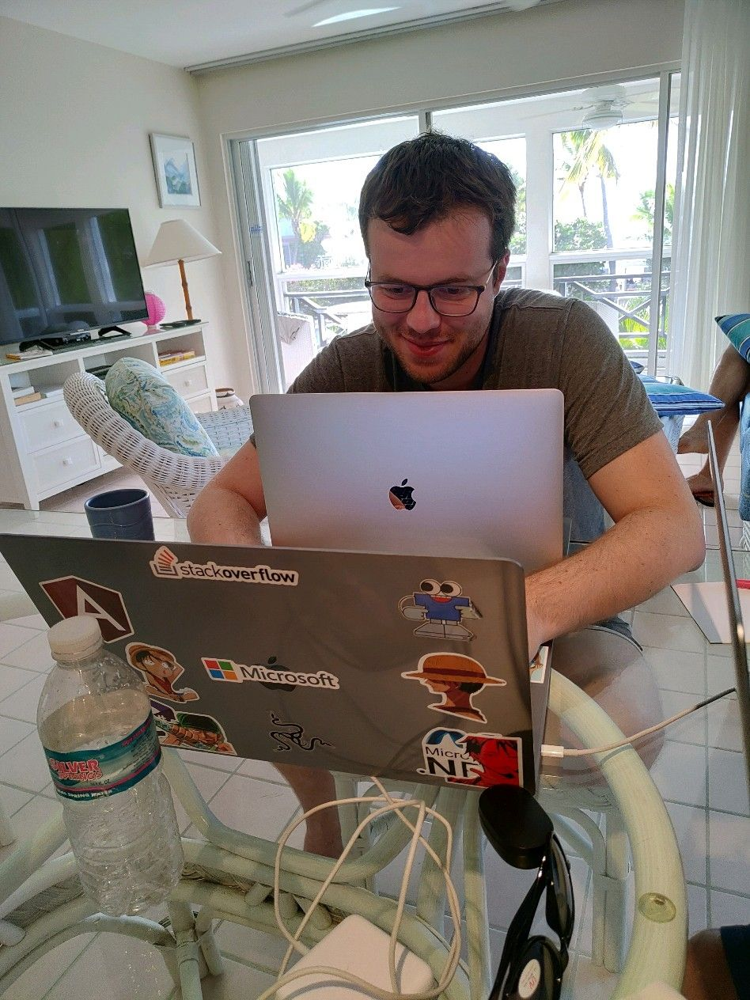

# BrunoLM 

I'm a Developer for Fun! Website: [brunolm.com](https://brunolm.com/), Blog: [brunolm.com/blog](https://brunolm.com/blog), LinkedIn: [brunolm.com/linkedin](https://www.linkedin.com/in/brunolm/)

## Tech

       

   

## Language (communication)

- English
- Portuguese

## Main interests / skills

- JavaScript
- TypeScript
- Nullstack
- Node.js
- C#
- React
- Angular

## Emotional Intelligence skills

- Self Awareness
- Self Management
- Social Awareness
- Relationship Management

## Numbers

### Stack Overflow

- 97k+ reputation (Top 0.16% overall)
- Rank ~#1220 of 623,527 ranked members (~12.7M total)
- ~20.3 million people reached
- Gold badge in: javascript, c# (and others)

## Socials

