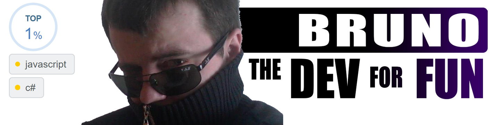
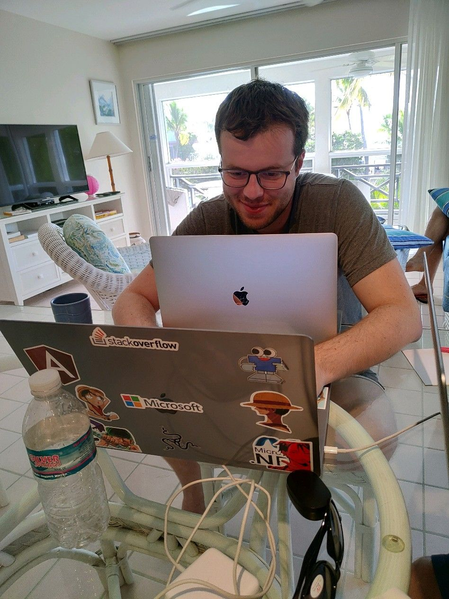
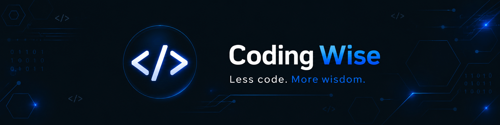

# BrunoLM

I'm a Developer for Fun!

Senior Software Engineer, self-taught since 2007, based in Florianópolis, Brazil. I build full-stack web apps, internal tools, browser/editor extensions, desktop apps, and AI-powered integrations.

- Portfolio: [brunolm.com](https://brunolm.com/)
- Company: [codingwise.com](https://codingwise.com/) — *Less code. More wisdom.*
- LinkedIn: [brunolm.com/linkedin](https://www.linkedin.com/in/brunolm/)

Almost two decades shipping software end-to-end — from internal tools that run entire companies to consumer products reaching millions of users, with side projects passing the 1M-download mark along the way. My stack centers on TypeScript, React, Next.js, Node.js, and C#, with a growing focus on AI-assisted development and LLM tooling.

## Tech

     

  

## Achievements

**Stack Overflow** — member since 2010
- 100k+ reputation, ranked ~#1245 on the all-time leaderboard
- ~23.1 million people reached
- Gold badges in JavaScript, C# (and others)

**GitHub**
- 160+ public repositories
- Side projects with 1M+ total downloads

**Other**
- CodeWars kyu 2
- Worked on consumer products reaching millions of users

## CodingWise

[codingwise.com](https://codingwise.com/) is my company. I take on:

- Full-stack web apps (TypeScript, React, Next.js, Node.js, C#)
- AI integrations and LLM-powered features
- Desktop and native Windows apps
- Browser and editor extensions
- Internal tools and automation
- Code review and technical consulting

## Side Projects

**[Hibiki Codex](https://hibikicodex.com/)** — Windows desktop app that captures your system audio, transcribes it locally with whisper.cpp, and lets you query Claude or Codex about what you've heard. Useful for anime scenes, podcasts, meetings, and lectures.

## About me

**Languages I speak**
English and Portuguese — fluent in both, comfortable working with teams in either.

**What I work with daily**
TypeScript, JavaScript, React, and AI.

**How I work**
I value autonomy, clear communication, and shipping.

## Socials

